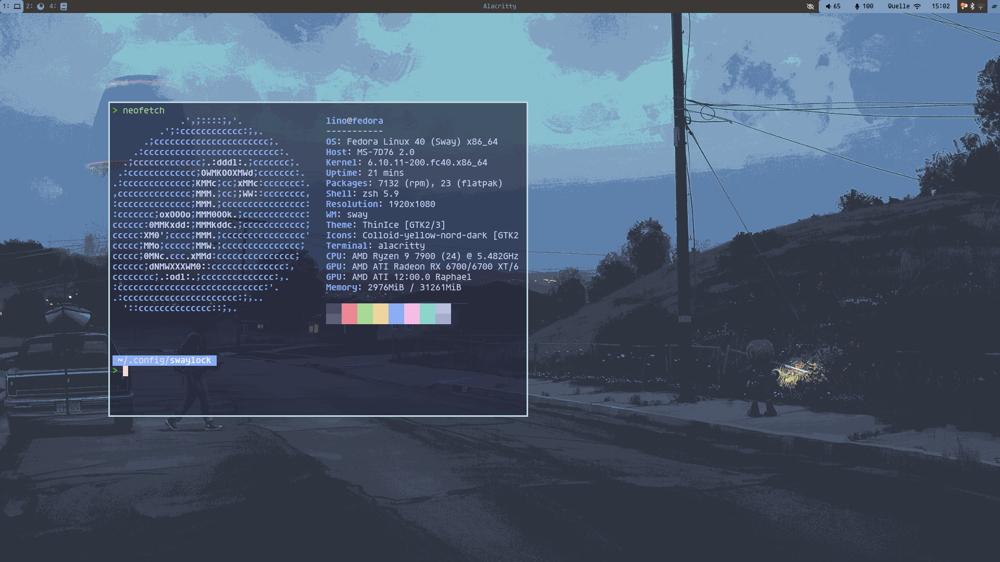
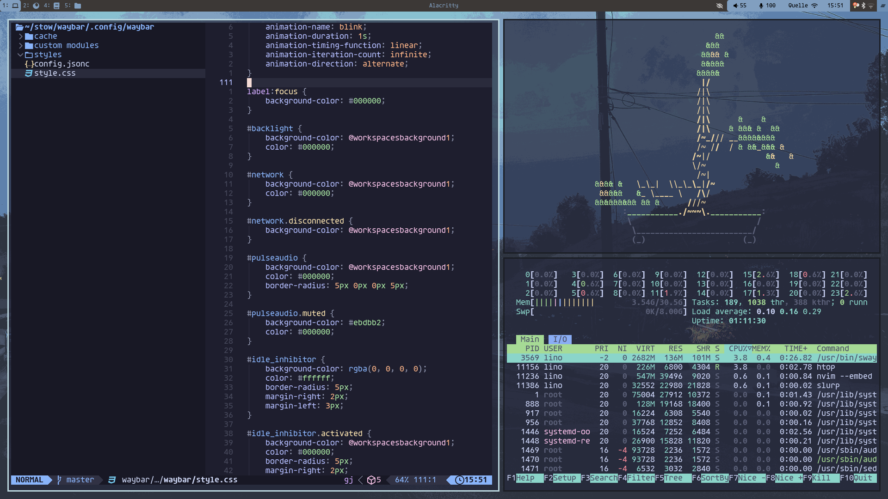

# Configuration files fedora-sway spin

## **Important**
These files are not optimized for other users! The wallpaper paths have to be adjusted. Additionally, the configuration will not work without some dependencies (see bellow). GTK theme, Icon Theme, and qt theme have to be installed manually. Please refer to These two links [GTK Theme](https://github.com/swaywm/sway/wiki/GTK-3-settings-on-Wayland) [Arch Wiki on Theming GTK and qt](https://wiki.archlinux.org/title/Uniform_look_for_Qt_and_GTK_applications)  The used Font is [Agave Nerd Font](https://www.nerdfonts.com/font-downloads). 

----- 

## Dependencies 

### [Pywal](https://github.com/dylanaraps/pywal.git) 
The colors of the waybar as well as sway windows change automatically based on the wallpaper. The walpaper has to be set in the sway config file. Additionally, the path to the same image has to be sepcified for pywal. Just replace the path for both with the desired image path. 
For pywal to work with waybar, you have to specify a custom pywal template for the wayar colors: Create a file with the following content in `~/.config/wal/templates/`: 


```
@define-color foreground {foreground};
@define-color background {background};
@define-color cursor {cursor};

@define-color color0 {color0};
@define-color color1 {color1};
@define-color color2 {color2};
@define-color color3 {color3};
@define-color color4 {color4};
@define-color color5 {color5};
@define-color color6 {color6};
@define-color color7 {color7};
@define-color color8 {color8};
@define-color color9 {color9};
@define-color color10 {color10};
@define-color color11 {color11};
@define-color color12 {color12};
@define-color color13 {color13};
@define-color color14 {color14};
@define-color color15 {color15};
```

### [Sway-interactive-screenshot](https://github.com/moverest/sway-interactive-screenshot.git) 

This is a small Python script written by Moverest. The script is already included in the sway folder. under `scripts/` the behaviour is bound to the `PRINT` key.  

### [Rofi templates](https://github.com/adi1090x/rofi.git)

A huge collection of rofi templates. A huge thanks to adi1090x. The templates are already included in the `rofi/` folder. Please refeer to the rofi template repo to change to a desired template. The template used in this config has been changed minimally. It is inspired by type1 Style2.  

## Fedora-Sway spin specific configs

The fedora Sway spin includes some configurations that are made by default and located in `/usr/share/sway/config.d/*.conf` or `/etc/sway/config.d/*.conf`. If the files are moved into the sway config folder under `$HOME/.config/sway/config.d/` they will be preffered over the config files in the `usr/share/` or `etc` directories. In this configuration, all the files were moved into the home config folder. Changes were only made to the files controlling the execution of swaylock and grimshot (for screenshots). Read more on this on [fedora-sway configuration guide](https://docs.fedoraproject.org/en-US/fedora-sericea/configuration-guide/)

## How to use
The folder is set up to be used with [stow](https://github.com/aspiers/stow). If you want to apply the config files to your own machine it is recommended to copy them manually.
For the sway-wm config file you could download the content of the folder `sway/.config/sway/` And place it in `~/.config/sway/`. Alternatively, you can clone the config folders into your stow directory and run stow. 

## Examples


### Waybar


### Rofi 


