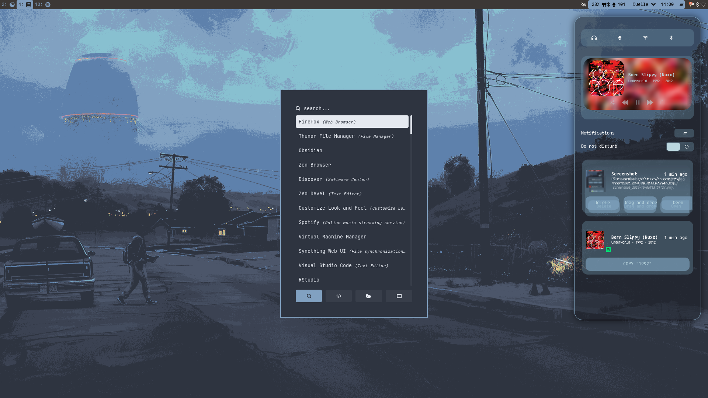

# Configuration files fedora-sway spin

## **Important**
These files are not optimized for other users! The wallpaper paths have to be adjusted. Additionally, the configuration will not work without pywal (see bellow). GTK theme, Icon Theme, and qt theme have to be installed manually. Please refer to These two links: [GTK Theme](https://github.com/swaywm/sway/wiki/GTK-3-settings-on-Wayland) and [Arch Wiki on Theming GTK and qt](https://wiki.archlinux.org/title/Uniform_look_for_Qt_and_GTK_applications)  The used Font is [Agave Nerd Font](https://www.nerdfonts.com/font-downloads). 

----- 

## Dependencies 

### [Pywal](https://github.com/dylanaraps/pywal.git) 
The colors alacritty, waybar, swaync as well as sway change automatically based on the wallpaper. The walpaper has to be set in the sway config file: `exec_always wal -i "yourwallpaper.png" -n`. The wallpaper can then be referenced with `$wallpaper` in the config file and used with your wallpaper application of choice. 

. Just replace the path for both with the desired image path. 
For pywal to work with waybar, you have to specify a custom pywal template for the wayar colors: Create a file named `colors-waybar.css` with the following content in `~/.config/wal/templates/`: 


```
@define-color foreground {foreground};
@define-color background {background};
@define-color cursor {cursor};

@define-color color0 {color0};
@define-color color1 {color1};
@define-color color2 {color2};
@define-color color3 {color3};
@define-color color4 {color4};
@define-color color5 {color5};
@define-color color6 {color6};
@define-color color7 {color7};
@define-color color8 {color8};
@define-color color9 {color9};
@define-color color10 {color10};
@define-color color11 {color11};
@define-color color12 {color12};
@define-color color13 {color13};
@define-color color14 {color14};
@define-color color15 {color15};
```

## Fedora-Sway spin specific configs

The fedora Sway spin includes some configurations that are made by default and located in `/usr/share/sway/config.d/*.conf` or `/etc/sway/config.d/*.conf`. If the files are moved into the sway config folder under `$HOME/.config/sway/config.d/` they will be preffered over the config files in the `usr/share/` or `etc` directories. In this configuration, all the files were moved into the home config folder. Changes were only made to the files controlling the execution of swaylock and grimshot (for screenshots). Read more on this on [fedora-sway configuration guide](https://docs.fedoraproject.org/en-US/fedora-sericea/configuration-guide/)

## How to use
The folder is set up to be used with [stow](https://github.com/aspiers/stow). If you want to apply the config files to your own machine it is recommended to copy them manually.
For the sway-wm config file you could download the content of the folder `sway/.config/sway/` And place it in `~/.config/sway/`. Alternatively, you can clone the the repo and use stow with the desired folders. This will automatically create a simlink with the config folders, so you do not have to copy any files manually. 

## Examples





