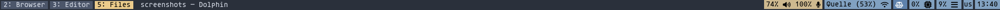
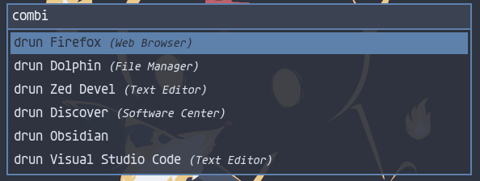

# Configuration files fedora-sway spin

## **Important**
These files are not optimized for other users! Some paths will not work on your system. GTK theme (Arc-Dark), Icon Theme (Colloid-yellow-nord-dark), and qt theme (KvArcDark) have to be installed manually. The used Font is [Agave Nerd Font](https://www.nerdfonts.com/font-downloads).

## Fedora-Sway spin specific configs

The fedora Sway spin includes some configurations that are made by default and located in `/usr/share/sway/config.d/*.conf` or `/etc/sway/config.d/*.conf`. If the files are moved into the sway config folder under `$HOME/.config/sway/config.d/` they will be preffered over the config files in the `usr/share/` or `etc` directories. In this configuration, all the files were moved into the home config folder. Changes were only made to the files controlling the execution of swaylock and grimshot (for screenshots). Read more on this on [fedora-sway configuration guide](https://docs.fedoraproject.org/en-US/fedora-sericea/configuration-guide/)

## How to use
The folder is set up to be used with [stow](https://github.com/aspiers/stow). If you want to apply the config files to your own machine it is recommended to copy them manually.
For the sway-wm config file you could download the content of the folder `sway/.config/sway/` And place it in `~/.config/sway/`. 

## Examples

### Sway Desktop

### Waybar

### Rofi 

